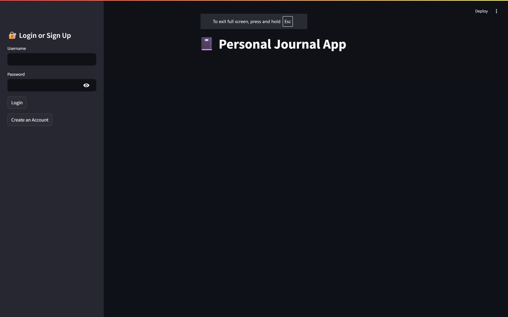
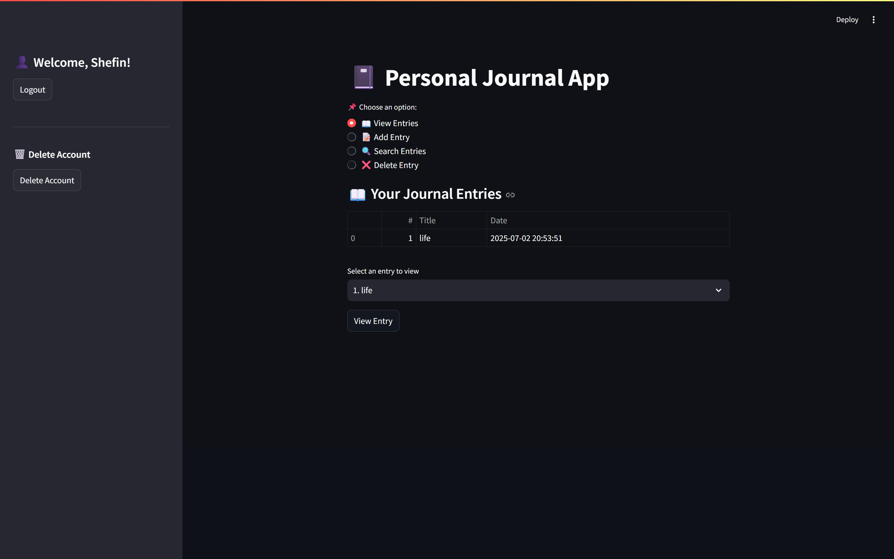
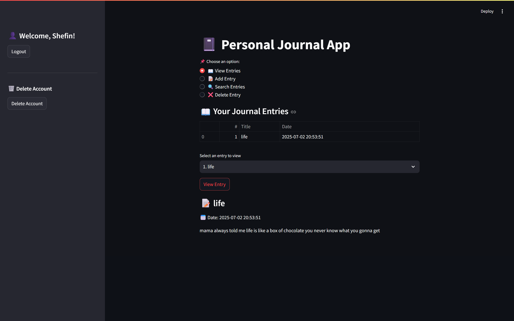
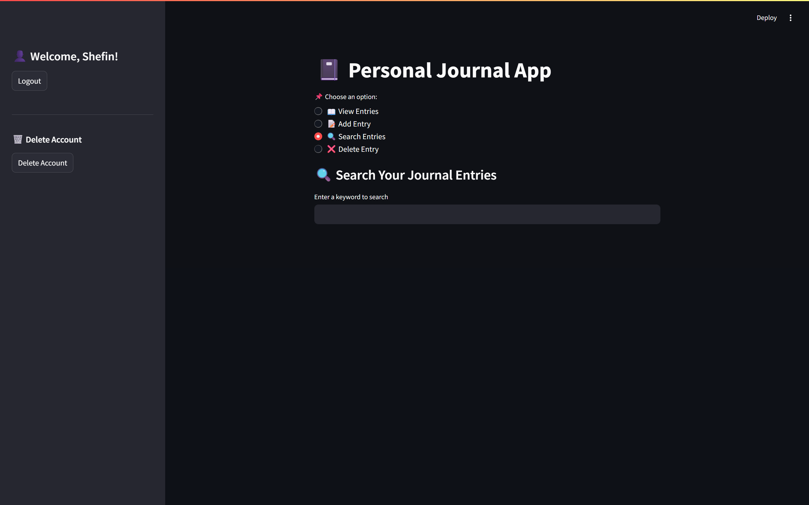
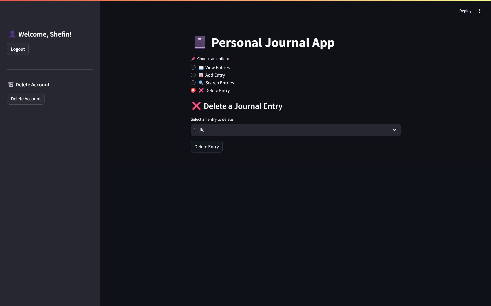

# 📓 Personal Journal App – Streamlit Project

A secure, user-friendly journal app built using Python and Streamlit, allowing users to create, view, search, and delete private journal entries. All data is stored locally in structured JSON format with persistent login functionality.

---

## 💡 Features
- 🧾 Create, view, and search personal journal entries  
- 🔒 User authentication with hashed passwords  
- 🧹 Clean UI with tabs for Add/View/Delete/Search  
- 🗃️ Entries saved with timestamps  
- 🔐 Option to delete your account and all data

---

## 🛠️ Tech Stack
- **Python**
- **Streamlit** for UI
- **JSON** for data storage
- **Hashlib** for password security
- **Pandas** for table views

---

## 🔍 How It Works
- Users sign up or log in (passwords are securely hashed)
- Each user’s entries are stored in `journal_entries.json`
- Users can:
  - 📝 Add new entries  
  - 📖 View past entries  
  - 🔍 Search by keyword  
  - ❌ Delete entries  
  - 🗑️ Delete their entire account and data

---

## 📁 File Structure
- `personal.py` – Main Streamlit app  
- `user.json` – Stores user login data (hashed passwords)  
- `journal_entries.json` – Stores journal entries

---

## 🖼️ Sample Entry Format

```json
{
  "username": "shefin",
  "title": "not a bad day",
  "content": "today was not as bad as I thought it would.",
  "timestamp": "2025-02-03 20:48:30"
}
```
---
## 🖼️ App Preview

### 🔐 Login / Sign-Up



### 📒 Journal Functions
- Add, view, delete, and search entries

**Add Entry**  


**View Entries (Table View)**  
  


**Search Entries**  


**Delete Entry / Account**  

